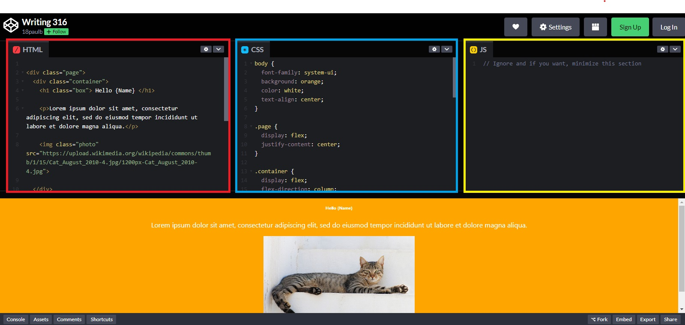
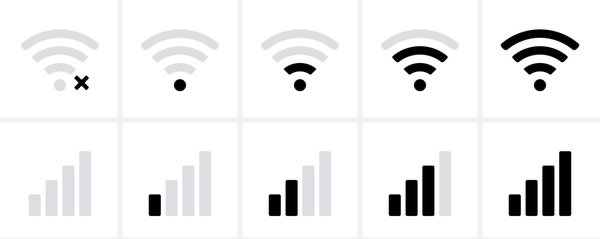
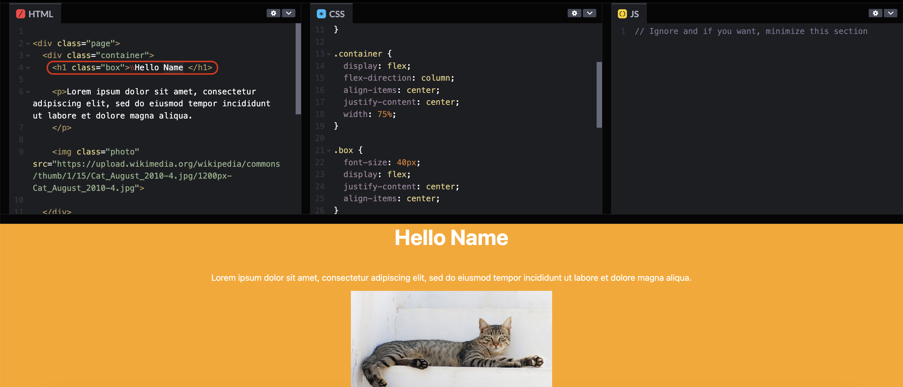
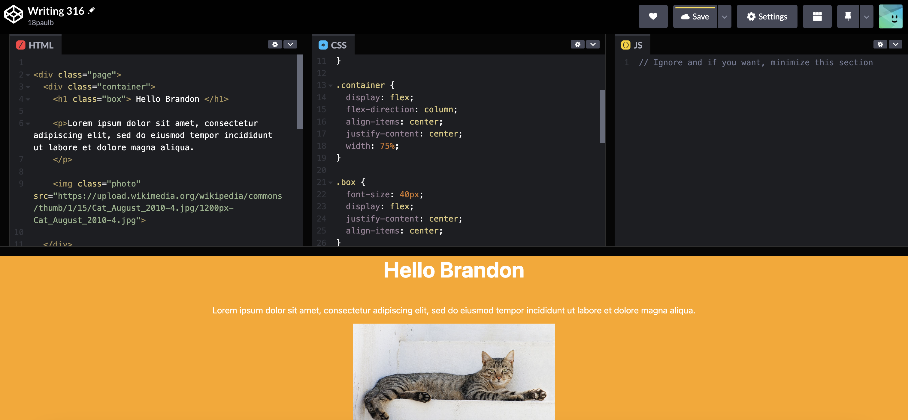
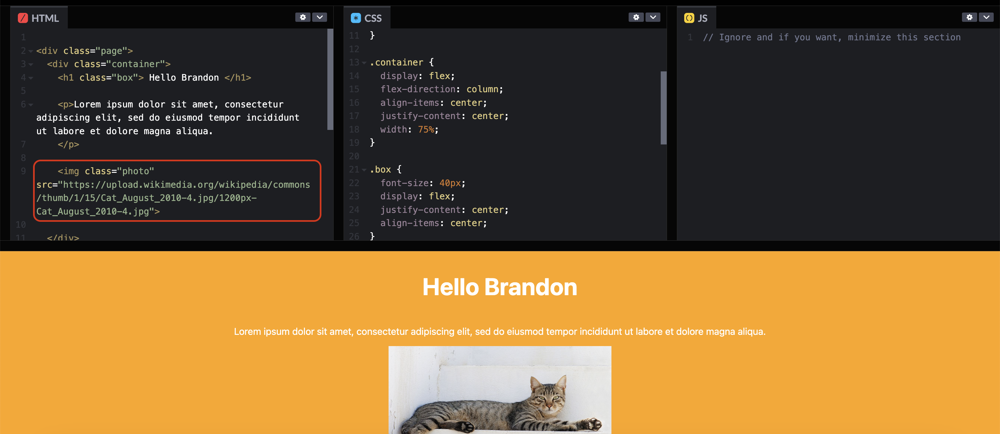
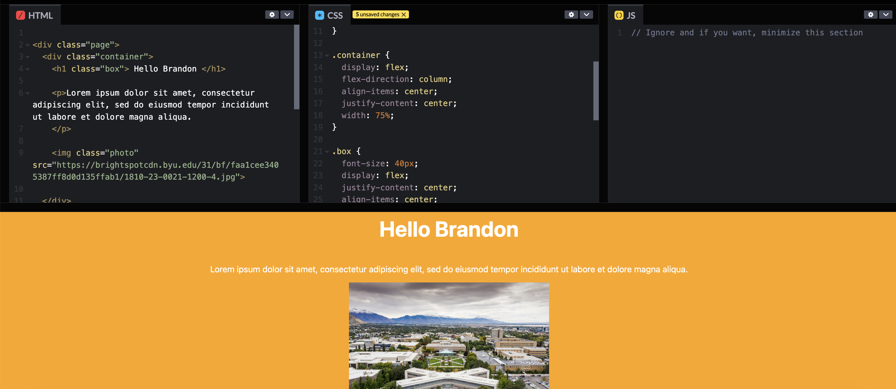
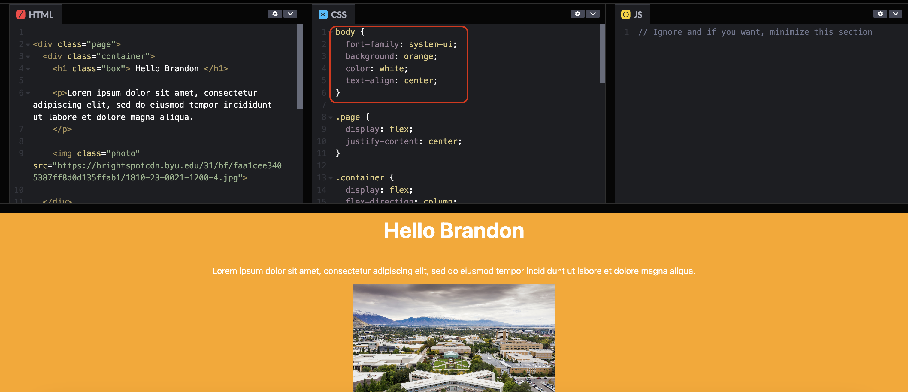
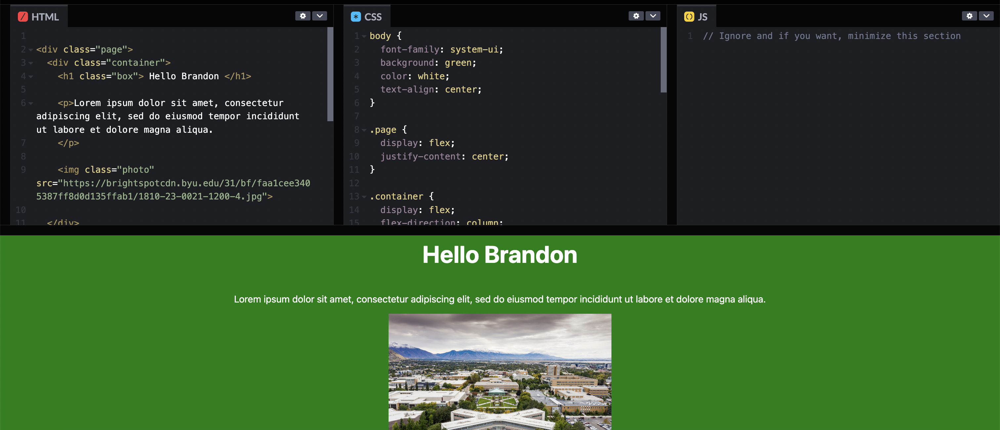

# Creating and Editing a Simple Webpage

# Introduction
In this day and age, everything requires a website. Through these instructions, you will learn basic editing of HTML and CSS, the building blocks of websites. 

You will be using a website called CodePen, in which there will be three sections titled HTML, CSS, and JS. The webpage will be displayed underneath. You will be editing the HTML and CSS sections.

# List of Requirements:
1. A computer
   

2. A stable internet connection

# Hazard Statements

### ⚠️ Caution ⚠️
If you refresh the CodePen page, you will lose all your progress.

# Numbered Steps

### Preparation Steps
1a. Open this link in a new tab: https://codepen.io/18paulb/pen/abeOKgd
 - The JS tab will be not be utilized in this project

### Altering Name Heading
2a. Find the text that says `Hello Name` in the HTML section (on the left)

2b. Replace `Name` with your name
   
The updated page should look similar to this:

### Changing The Image
3a. In the HTML Section, find this line:

3b. Delete the url found after the `src=` and put in this new url `"https://brightspotcdn.byu.edu/31/bf/faa1cee3405387ff8d0d135ffab1/1810-23-0021-1200-4.jpg"`
 - Make sure that you have quotes around the link

The updated page should look similar to this:

### Changing Background Color
4a. Find this code in the CSS section

4b. Change the background color by changing `background: orange;` to `background: green;` 
 - Make sure not to delete the semicolon at the end of the line

The updated page should look similar to this:

# Comments, Notes, and Examples

# Troubleshooting
 - If the image you chose from Google Images isn't showing up:
    - Make sure the image link is surrounded by quotes: `"www.example.com/image"`
    - Choose a new image to try instead.
 - If any changes aren't showing up:
    - Check the CSS section for any missing semicolons at the end of lines.
    - Check the HTML section and make sure you haven't deleted any of the tags (things in `<>` brackets)

# Conclusion
**Congratulations!** 

By following these steps, you have successfully edited a simple webpage. You’ve learned the basics of using HTML and CSS. Through this exercise, you’ve explored fundamental techniques such as... 

1. Modifying text
2. Changing images
3. Updating body content
4. Altering background colors

These basic steps provide a starting point for editing and personalizing websites. With a bit of practice, you can try making more changes and exploring other features of HTML and CSS to further customize webpages as you become more comfortable with the process.

### Survey
Let us know how you did! Take our survey here: https://forms.gle/XGoQfi4BTCYuYp6V6
